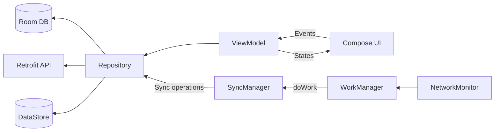

# TaskManager

An offline-first task management Android app built for d.Light's engineering challenge, designed to work reliably in network-limited environments with automatic synchronization.

<p align="center">
  
  
  
  
  
  
</p>

## Demo

*⚠️ TODO:*
- Add 3min video
- Add 2 screenshots

  

## Features

- [x] **Full Offline Support** – Create, view, update, and delete tasks without a network connection  
- [x] **Automatic Sync** – Background synchronization when a network is available  
- [x] **Conflict Resolution** – Last-write-wins strategy for predictable data merging  
- [x] **MVVM + Repository Pattern** – Layered design using Room as the single source of truth  
- [x] **Real-time Updates** – Instant UI updates powered by Kotlin Flow  
- [x] **Network Monitoring** – Detects connectivity changes to trigger immediate sync  
- [x] **Background Sync** – WorkManager ensures data consistency even when the app is closed  
- [x] **Compose Previews** – Each UI component includes previews for faster development  
- [ ] **Advanced Sync** – User-driven conflict resolution *(in development)*  


## Installation

### Prerequisites

- Android Studio Meerkat | 2024.3.1 Patch 2 or later
- JDK 17
- Android SDK 35 (minSdk 26)
- Node.js (for mock server)

### Setup

1. Clone the repository:
```bash
git clone https://github.com/Ericgacoki/TaskManager.git
cd TaskManager
```
2. Install and start the mock server:
```bash
npm install -g json-server
json-server --watch db.json --port 3000
```

3. Build and run:
```bash
# For emulator (uses http://10.0.2.2:3000)
./gradlew installEmulatorDebug

# For physical device (update IP in build.gradle)
./gradlew installDeviceDebug
```

## Usage

### Running the App

1. **Start the mock server** (see Installation)
2. **Launch the app** from Android Studio or command line
3. **Login** with any email (no password required)
4. **Create tasks** - Works immediately, even offline
5. **Toggle network** - Watch automatic sync in action

## Design/Architectural decisions

### Tech Stack

- **Language:** Kotlin
- **UI:** Jetpack Compose with Material 3
- **Architecture:** MVVM + Repository Pattern
- **Database:** Room
- **Storage:** DataStore (preferences)
- **Networking:** Retrofit + OkHttp
- **DI:** Hilt/Dagger
- **Async:** Kotlin Coroutines + Flow
- **Background:** WorkManager
- **System:** NetworkMonitor
- **Animations:** Lottie
- **Testing:** JUnit, Mockito, MockWebServer

### Project Structure

The app follows a layered architecture with three main layers:

- **Domain Layer** - Business logic, models, and repository interfaces
- **Data Layer** - Repository implementations, Room database, API services, and data mappers
- **Presentation Layer** - ViewModels, Compose screens, and UI components

### Architecture/Flow Overview



<details>
<summary>Detailed Project Structure</summary>

```
TaskManager/
├── app/
│   └── src/
│       ├── main/
│       │   ├── java/.../taskmanager
│       │   │   ├── domain/        # Models & interfaces
│       │   │   ├── data/          # Repository implementations
│       │   │   │   ├── local/     # Room database
│       │   │   │   ├── remote/    # API services
│       │   │   │   └── mapper/    # Data transformations
│       │   │   └── presentation/  # UI layer
│       │   │       ├── viewmodel/ # ViewModels
│       │   │       ├── screen/    # Compose screens
│       │   │       └── component/ # Reusable UI components
│       │   └── res/               # Resources - Icons and stuff
│       └── test/                  # Unit & integration tests
└── build.gradle.kts               # Build configuration
```
</details>

### Sync Architecture

The app uses a **dual-layer sync strategy** optimized for network-limited environments:

**NetworkMonitor** triggers instant `one-time` syncs when the app is open and connectivity is restored, capturing brief online windows that WorkManager's 15-minute `periodic` cycle would miss.

**WorkManager** handles reliable periodic syncs every 15 minutes even when the app is closed, using network constraints and respecting battery optimization and Doze mode.

Together, they ensure fast, consistent updates with minimal power consumption - immediate sync during active use and guaranteed eventual consistency in the background.

> [!NOTE]
> "The exact time that the worker is going to be executed depends on the constraints that are used in your WorkRequest and on system optimizations. WorkManager is designed to give the best behavior under these restrictions." 
>
> [Refer to Docs](https://developer.android.com/develop/background-work/background-tasks/persistent/getting-started#submit_the_workrequest_to_the_system)


**Conflict Resolution**
- Last-write-wins based on `updatedAt` timestamp
- Automatic merging without user intervention
- I'm working on advanced mode where users can choose which version to keep - Giving the user "more control".

## Testing

The project includes comprehensive test coverage:

- **Unit Tests:** Repository logic, data mapping, business logic edge cases
- **Integration Tests:** Room DAO, API calls with MockWebServer
- **UI Tests:** End-to-end user flow with Compose Testing

```bash
# Unit tests
./gradlew test

# Integration tests (requires device/emulator)
./gradlew connectedAndroidTest

# All tests with coverage
./gradlew testDebugUnitTest connectedDebugAndroidTest
```

### Test Results

Below is a screenshot of DAO Test results on an Android 11 OPPO device:


More test results can be viewed [here]()

## Acknowledgments

- Built for the d.light Android Engineer assessment  
- Inspired by offline-first architecture patterns  
- Thanks to the Android community for excellent documentation  

## Contributing

Fork the repo, create a feature branch, and submit a PR.  
Follow existing code patterns and include relevant tests.

> [!NOTE]
> This is a technical assessment project demonstrating offline-first architecture, background synchronization, and clean code practices in Android development.

---

## License

MIT License – see the [LICENSE](LICENSE) file for details.
