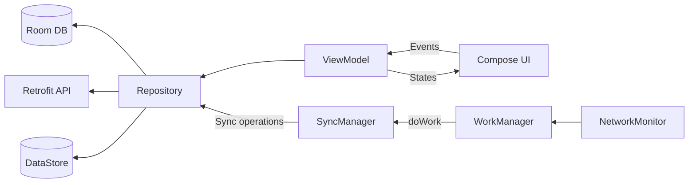
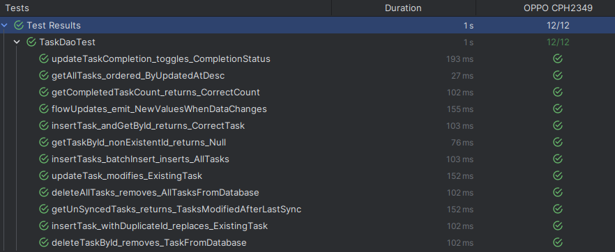

# TaskManager

An offline-first task management Android app built for d.Light's engineering challenge, designed to work reliably in network-limited environments with automatic synchronization.

<p align="center">
  
  
  
  
  
</p>

## Demo

*⚠️ TODO:*
- Add 3min video
- Add 2 screenshots

  

## Features

- Full Offline Support - Create, edit, delete, and mark task as complete.
- Real-time/Instant UI Updates
- Automatic Sync
- Conflict Resolution
- Network Monitoring
- Background Sync
- Advanced Sync *(in development)*  


## Installation

### Prerequisites

- Android Studio Meerkat | 2024.3.1 Patch 2 or later
- JDK 17
- Android SDK 35 (minSdk 26)

### Setup

1. Clone the repository:
```bash
git clone https://github.com/Ericgacoki/TaskManager.git
cd TaskManager
```

2. Build and install:
```bash
./gradlew installDebug
```

> [!Note] 
> The app uses a deployed mock server on [Vercel](https://task-manager-alpha-three-98.vercel.app/) - no local server setup is required!

## Usage

### Running the App

1. **Launch Task Manager** once installation is done
2. **Login** with any valid email (no password required)
3. **Create tasks** - Works immediately, even offline
4. **Toggle network** to see automatic sync in action

<details>
<summary><strong>User Actions by Screen and Task Mode</strong></summary>

> `TaskMode` is a state that defines the actions and behavior of the Task Detail Screen: CREATE (new task), EDIT (modify existing), or VIEW (read-only display).
>
> Using TaskMode centralizes state management and significantly reduces the number of screens required to achieve similar functionalities.

**Login Screen:**
- Enter any valid email address
- Tap "Log In" (A short delay simulates network call)

**Task List Screen:**
- View all tasks
- View the last successful sync time
- Pull down to refresh
- Trigger manual sync and retry failed sync
- Tap FAB (+ button) to create new task. Auto enters CREATE mode.
- Tap any task to view details
- Toggle task completion/delete via dropdown menu
- Delete all tasks
- Log out

**Task Detail Screen (CREATE mode):**
- Enter task title and description
- Select due date
- Tap `Save` to create task or `Cancel` to discard
- Tap back arrow to cancel

**EDIT mode**
- Tap edit form task menu or the pen icon to enter EDIT mode
- Modify title, description, or due date
- Tap "Save" to update task. This auto switches to VIEW mode
- Tap back arrow (unsaved changes show discard dialog)

**VIEW mode**
- View full details of a task
- Tap edit icon to switch to EDIT mode
- Tap delete icon to delete
- Toggle task completion via the checkbox 
- Tap back arrow to return to list

</details>

> [!WARNING]
> Since Task Manager uses a shared demo server with no authentication, you may see tasks created by other users testing the app. This actually demonstrates the real-time sync capabilities! Data resets periodically (approximately every 10-15 minutes of inactivity) as the server uses in-memory storage.

## Design/Architectural decisions

### Tech Stack

- **Language:** Kotlin  
- **Architecture:** MVVM + Repository Pattern  
- **DI:** Hilt / Dagger  
- **UI:** Jetpack Compose with Material 3  
- **Animations:** Lottie  
- **Development:** Compose Previews (each UI component includes previews for rapid development)  
- **Database:** Room as the single source of truth  
- **Storage:** DataStore (preferences)  
- **Networking:** Retrofit + OkHttp  
- **Async:** Kotlin Coroutines + Flow (enables real-time UI updates)  
- **Background:** WorkManager  
- **System:** NetworkMonitor (connectivity detection)  
- **Testing:** JUnit, Mockito, MockWebServer  

### Project Structure

The app follows a layered architecture with three main layers:

- **Domain Layer** - Business logic, models, and repository interfaces
- **Data Layer** - Repository implementations, Room database, API services, and data mappers
- **Presentation Layer** - ViewModels, Compose screens, and UI components

### Architecture/Flow Overview



<details>
<summary>Package Structure</summary>

```
TaskManager/
├── app/
│   └── src/
│       ├── main/
│       │   ├── java/.../taskmanager
│       │   │   ├── domain         # Models & interfaces
│       │   │   ├── data/          # Repository implementations
│       │   │   │   ├── local      # Room database
│       │   │   │   ├── remote     # API services
│       │   │   │   └── mapper     # Data transformations
│       │   │   └── presentation   # UI layer
│       │   │       ├── viewmodel  # ViewModels
│       │   │       ├── screen     # Compose screens
│       │   │       └── component  # Reusable UI components
│       │   └── res                # Resources - Icons and stuff
│       └── test                   # Unit & integration tests
└── build.gradle.kts               # Build configuration
```
</details>

### Sync Architecture

The app uses a **dual-layer sync strategy** optimized for network-limited environments:

**NetworkMonitor** triggers instant `one-time` syncs when the app is open and connectivity is restored, capturing brief online windows that WorkManager's 15-minute `periodic` cycle would miss.

**WorkManager** handles reliable periodic syncs every 15 minutes even when the app is closed, using network constraints and respecting battery optimization and Doze mode.

Together, they ensure fast, consistent updates with minimal power consumption - immediate sync during active use and guaranteed eventual consistency in the background.

> [!NOTE]
> "The exact time that the worker is going to be executed depends on the constraints that are used in your WorkRequest and on system optimizations. WorkManager is designed to give the best behavior under these restrictions." 
>
> [Refer to Docs](https://developer.android.com/develop/background-work/background-tasks/persistent/getting-started#submit_the_workrequest_to_the_system)


**Conflict Resolution**
- Last-write-wins based on `updatedAt` timestamp
- Automatic merging without user intervention
- I'm working on advanced mode where users can choose which version to keep - Giving the user "more control".

## Testing

The project includes comprehensive test coverage:

- **Unit Tests:** Repository logic, data mapping, business logic edge cases
- **Integration Tests:** Room DAO, API calls with MockWebServer
- **UI Tests:** End-to-end user flow with Compose Testing

```bash
# Unit tests
./gradlew test

# Integration tests
./gradlew connectedAndroidTest

# All tests
./gradlew testDebugUnitTest connectedDebugAndroidTest
```

### Test Results

Below is a screenshot of DAO Test results on an Android 11 OPPO device:



## Acknowledgments

- This project is built for the d.light Android Engineer assessment  
- Inspired by offline-first architecture patterns  
- Thanks to the Android community for excellent documentation

## Contributing

Fork the repo, create a feature branch, and submit a PR.  
Follow existing code patterns and include relevant tests.

> [!NOTE]
> This is a technical assessment project demonstrating offline-first architecture, background synchronization, and clean code practices in Android development.

---

## License

MIT License – see the [LICENSE](LICENSE) file for details.
